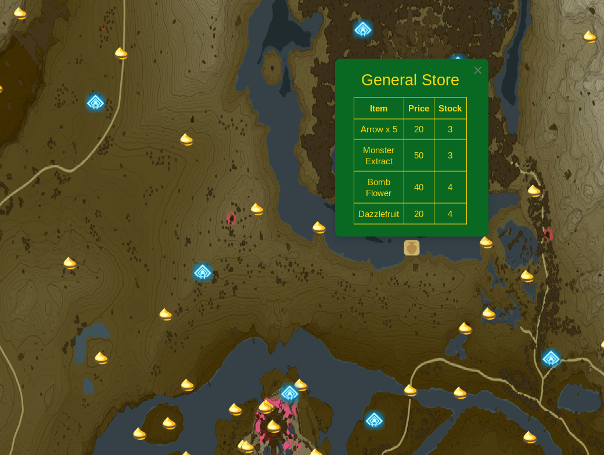

# Legend of Zelda: Tears of the Kingdom Map
[By Alshival's Data Service](https://www.alshival.com/reports/legend-of-zelda-tears-of-the-kingdom/korok-seeds)



## Map Layers

The TOTK map includes the following layers:

- **Sky Towers**: This layer shows the locations of sky towers on the map.
- **Shrines**: This layer displays the locations of land shrines.
- **Korok Seeds**: This layer marks the locations of korok seeds, including both regular and sky korok seeds.
- **Zonai Dispensers**: This layer indicates the locations of Zonai dispensers and provides information about the Zonai devices they offer.
- **General Shops**: This layer marks general shops on the map. Clicking on a shop reveals information about the items for sale.
- **Armor Shops**: This layer marks armor shops on the map. Clicking on a shop reveals information about the items for sale.
  
You can download the `totk-map.html` file and open it in your browser, or embed it in a site somewhere. On moble devices, it is easier to download the `totk-map.zip` file and extract it, then open the HTML file.

The map above shows the location of all Korok seeds in the Legend of Zelda: Tears of the Kingdom. 

The korok location data does not indicate whether a seed is on a sky island or not. A quick analysis showed that any Korok seed with height greater than 800 can be considered to be on a sky island. These seeds are represented with a blue korok seed in our map. It is entirely possible that a seed marked as being on land is somehow on a low-hanging island. Keep that in mind when using this map.

Thank you to Phil, Aeon, and SuperSpazzy for the [Data Source](https://docs.google.com/spreadsheets/d/1fBvQ17WHP3ASgtO8ode_rf1g4DfEHErMrHwwLppNTJM/edit?usp=sharing).

# Map Generation

You can customize the map generation process by modifying the code.
Feel free to explore the code and make changes to suit your requirements.


1. The map currently uses a lower resolution background, but a high-resolution background image is available. You can find the referenced map file in the code and replace.

```python
# Add the background image.
totk_overlay = folium.raster_layers.ImageOverlay(
    image = 'map_data/base_map_low_res.png',
    bounds=bounds,
    overlay=False,
    control=False,
    name="TOTK Map",
    zindex=1
)
```

2. Coordinates from the TOTK game are converted to coordinates on the Folium map using scaling functions.
3. Data for sky towers, shrines, korok seeds, and dispensers is imported and processed.

## License

This TOTK map is made available under the [Creative Commons Attribution 1.0](https://creativecommons.org/publicdomain/zero/1.0/) license. You are free to use, modify, and distribute the map for personal or commercial purposes.

---

Feel free to contribute to the development of this TOTK map by submitting bug reports, feature requests, or pull requests. Happy gaming!
